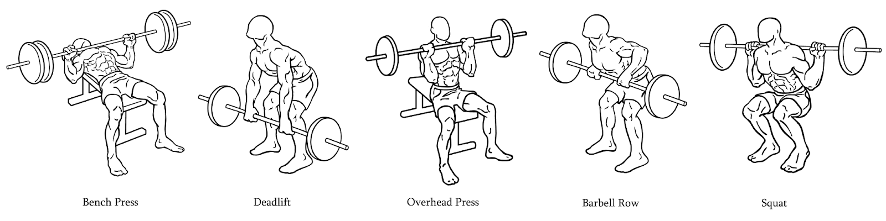

# Project Title
Coding A Fitness Tracking: Exploring the Possibilities of Context-Aware Applications for Strenght training.

## Overview
This project is a reimplementation of [Dave Ebbelaar's](https://www.linkedin.com/in/daveebbelaar/) Full Machine Learning Project. It entails analysing sensor data and using ML model to predict a workout type and to count repetitions. [See play list here](https://www.youtube.com/playlist?list=PL-Y17yukoyy0sT2hoSQxn1TdV0J7-MX4K) 

## Table of Contents

- [Parts](#Parts)
- [Installation](#installation)
- [Data](#data)
- [Technologies Used](#technologies-used)
- [License](#license)

## Parts

- Processing Raw Data
- Data Visualization with Matplotlib
- Detecting Outliers in Sensor Data
- Low-pass Filter & Principal Component analysis
- Fourier Transformation & clustering
- Predictive Modelling
- Counting Repetitions

## Installation

Refer to environment.yml file for the full environment setup with conda

## Data
check the first video description of the playlist for the link to the data

## Technologies Used
List the main technologies, frameworks, and libraries used in your project.
- Python
- Pandas
- Matplotlib
- Seaborn
- Scikit-learn

## License

This project is licensed under the MIT License.